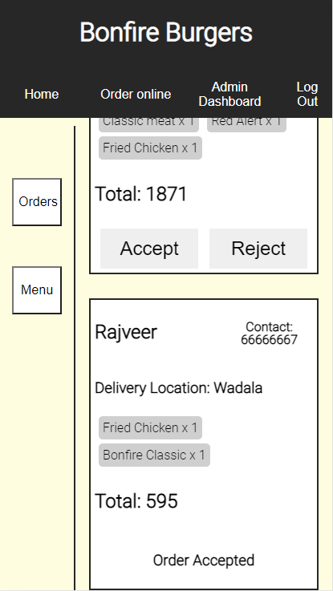
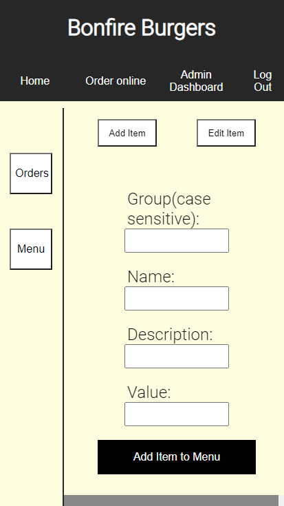

Bonfire Burgers //

A webApp for delivery kitchens. Optimized for all screen sizes.

Live site: https://rajhanspol.github.io/bonfireburgers/
Test accounts have been added in the logIn page, for both Admin and Customers. Feel free to login and enjoy the app!

Description:

App has two types of users. ADMIN and CUSTOMERS.

Customers on authentication can place orders and view order status(wether it has been Accepted or Rejected)

Admin can view all orders placed by different customers, and accept or reject orders. Admin can also change or edit menu items. More admin featuers are yet to be added.

<strong>As a customer -</strong>  

 
Select order Items - 
 

 
View selected Items and add more or checkout (if no user is logged in, checkout will redirect to login Page)-
 

 
Add your details and place your order - 
 

 
Once your orders are placed, view your orders and get notified of order status- 
 

<strong>As an admin -</strong>  

 
Accept or reject orders - 
 

 
Add or edit menu items - 
 

